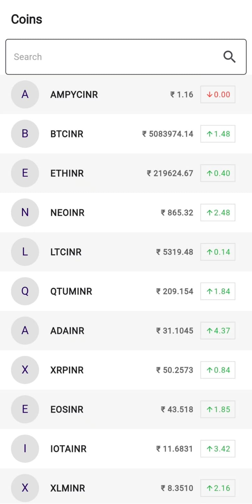

# Crypto App Home Page 

This repository contains the implementation of the Ampiy app's Home Page, designed with an enhanced UI and connected to a WebSocket API to display real-time cryptocurrency ticker data.

## Features

- **Creative UI:** The home page UI is designed to be clean, modern, and user-friendly.
- **WebSocket Integration:** The app connects to the WebSocket API to fetch real-time cryptocurrency prices.
- **Search Functionality:** Users can search for specific coins using the search bar.

## Getting Started
### Installation

1. **Clone the repository:**

   ```bash
   git clone https://github.com/your-username/ampiy-app-homepage.git
   cd ampiy-app-homepage

2. **Install Dependencies**
    flutter pub get

3. **Run the app**
    flutter run

## Screen Recording

[APP](assets/screen_recording/Crypto_Screenrecording.mp4)

## Code Structure

### HomeScreen

The `HomeScreen` is the main screen of the app, displaying a list of cryptocurrency tickers. It includes the following components:

- **App Bar:** Displays the title "Coins".
- **Search Bar:** Allows users to filter the list of coins.
- **Ticker List:** A scrollable list of tickers fetched from the WebSocket API. Each ticker shows the symbol, current price, and price change percentage.

### WebSocket Integration

The app connects to the WebSocket API using the `WebSocketService` class, which handles the connection and data retrieval. The `HomeBloc` class manages the state of the app, including loading data, searching coins, and handling errors.

### State Management

The app uses the BLoC (Business Logic Component) pattern for state management, ensuring a clear separation between the UI and business logic.

- **Events:** Defined in `home_event.dart`, including `WebSocketConnection` and `SearchCoinsEvent`.
- **States:** Defined in `home_state.dart`, including `TickerLoading`, `TickerDataLoaded`, and `TickerError`.
- **BLoC:** The `HomeBloc` class listens to events and emits states based on the data fetched from the WebSocket.

### UI Preview

Here’s a preview of the app’s home page:



### Future Enhancements

- **Pagination:** Implement pagination for large lists of tickers.
- **Error Handling:** Improve error handling for network issues.
- **Theming:** Add support for dark mode.